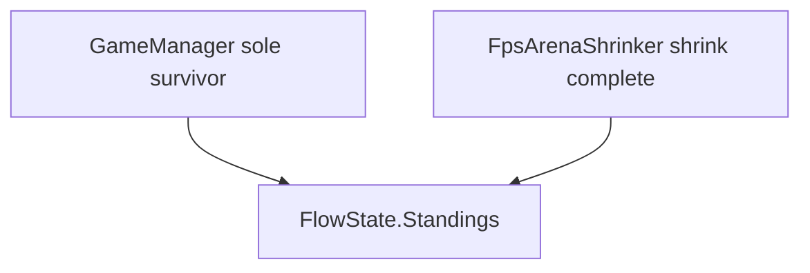

# Fraction-based shrink/alarm + round end rules

## Requirements (confirmed)

- **Fractions only** in the inspector (no parallel second-based schedule fields).
- **Shrink** begins when remaining match time ≤ `matchDuration × shrinkStartFraction` (e.g. `0.15` ⇒ last 15% of the match).
- **Alarm** begins when remaining time ≤ `matchDuration × (shrinkStartFraction + alarmLeadFraction)` so the alarm starts **earlier on the clock** than shrink by **`alarmLeadFraction` of total match time** (not a fraction of the shrink window).
- **Round must not end** until **either** arena shrink has **completed**, **or** there is **one player left** (sole survivor).

## Schedule math (centralize in code)

Add in [ArenaShrinkSchedule.cs](Assets/Scripts/MasterBlaster/Runtime/Scenes/Arena/Map/ArenaShrinkSchedule.cs) (names can be adjusted):

- `GetShrinkThresholdRemainingFromFraction(float matchDuration, float shrinkStartFraction)`  
  → `matchDuration * Clamp01(shrinkStartFraction)`
- `GetAlarmThresholdRemainingFromFraction(float matchDuration, float shrinkStartFraction, float alarmLeadFraction)`  
  → `matchDuration * Clamp01(shrinkStartFraction + alarmLeadFraction)`

Existing helpers `ShouldAlarmBeOn`, `ShouldStartShrinkByRemaining`, etc. stay; they consume the **remaining-time thresholds** produced above.

**Inspector** on [FpsArenaShrinker.cs](Assets/Scripts/MasterBlaster/Runtime/Scenes/Arena/Map/FpsArenaShrinker.cs) and [ArenaShrinker.cs](Assets/Scripts/MasterBlaster/Runtime/Scenes/Arena/Map/ArenaShrinker.cs):

- Remove `shrinkRemainingSeconds` and `alarmLeadSecondsBeforeShrink`.
- Add `[SerializeField] float shrinkStartFraction` (e.g. `0.15f`) and `[SerializeField] float alarmLeadFraction` (e.g. `~0.017` for ~3s on a 180s match, or tune to taste).
- Use `EffectiveMatchDuration()` (already includes editor quick test) when computing thresholds everywhere: `ComputeAlarmThresholdRemaining`, `ComputeShrinkThresholdRemaining`, and `TimerRoutine` locals.

[HybridMatchAlarmTimer.cs](Assets/Scripts/MasterBlaster/Runtime/Scenes/Arena/Map/HybridMatchAlarmTimer.cs): replace `alarmWhenSecondsRemainingOrLess` with **`alarmStartFraction`** (alarm when remaining ≤ `matchDuration × alarmStartFraction`) for consistency.

**Prefabs** ([Game.prefab](Assets/Prefabs/MasterBlaster/Scenes/Game.prefab), [TrainingArena.prefab](Assets/Prefabs/MasterBlaster/TrainingArena.prefab)): migrate serialized data — e.g. old `27/180 ≈ 0.15`, old `3/180 ≈ 0.0167` for lead (or round to `0.02`).

**Tests** (unity-skill): extend [ArenaShrinkScheduleEditModeTests.cs](Assets/Scripts/Tests/EditMode/ArenaShrinkScheduleEditModeTests.cs) with fraction cases (alarm threshold > shrink threshold, alarm before shrink on clock).

## Round end: shrink complete vs one man standing

**Current behavior (baseline for audit):**

- [GameManager.cs](Assets/Scripts/MasterBlaster/Runtime/Scenes/Arena/GameManager.cs) already evaluates **sole survivor** via `ArenaLogic.EvaluateWinState` and can transition to Standings / Overs / etc. when **one player remains** (see ~lines 853–977).
- [FpsArenaShrinker.cs](Assets/Scripts/MasterBlaster/Runtime/Scenes/Arena/Map/FpsArenaShrinker.cs) `TimerRoutine` already **waits** for `shrinkingComplete` before `SceneFlowManager.I.GoTo(FlowState.Standings)` (see post-loop wait ~508–512 and transition ~521–527), so the clock hitting **0** does not by itself finish the round while shrink is still running.

**Plan for this task:**

1. **Audit** call paths: confirm no other component (e.g. [HybridMatchAlarmTimer](Assets/Scripts/MasterBlaster/Runtime/Scenes/Arena/Map/HybridMatchAlarmTimer.cs) when not disabled) forces Standings on time-only while shrink is active in FPS scenes.
2. **If needed:** gate shrinker-driven `GoTo(Standings)` with `endingTriggered` / flow checks so it does not double-fire if GameManager already ended the round on last-alive; or document that sole survivor takes precedence (minimal change preferred).

## Commit (after green)

Conventional commit, stage only schedule + tests + touched prefabs, e.g. `refactor(masterblaster): fraction-based shrink and alarm schedule`.
