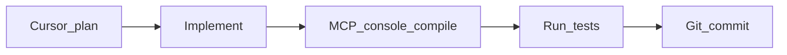

# MasterBlaster — IGO721 indie prototype

-blue)

**MasterBlaster** is a single-player prototype that combines **Bomberman-style arena combat** (top-down) and **first-person combat** in one session. It extends the [Unity FPS Microgame](https://learn.unity.com/project/fps-microgame) with a hybrid mode switch so you can move between grid-based bombing and FPS shooting without leaving the run.

**Primary scene (play in Editor):** [`Assets/Scenes/MasterBlaster/MasterBlaster_FPS.unity`](Assets/Scenes/MasterBlaster/MasterBlaster_FPS.unity)

**Unity version:** `6000.3.9f1` — see [`ProjectSettings/ProjectVersion.txt`](ProjectSettings/ProjectVersion.txt).

---

## How to run

1. Open this folder as a Unity 6 project (version above).
2. Open **`MasterBlaster_FPS`** (path above) and press **Play**.
3. **Vendor-only assets:** `Assets/3rdParty/` is not committed to git (see [Third-party assets](#third-party-assets)). For a full local copy, extract the same archive used in CI (e.g. `3rdparty-ci.zip` at the repo root) so that `Assets/3rdParty/` exists, or run the project’s third-party setup step if you use one.

---

## Android CI AAB builds

The shared GitHub workflow now includes an Android build lane that outputs a signed `.aab` artifact using `game-ci/unity-builder`.

### Required GitHub secrets

- `ANDROID_KEYSTORE_BASE64`: Base64-encoded keystore file contents.
- `ANDROID_KEYSTORE_PASS`: Keystore password.
- `ANDROID_KEYALIAS_NAME`: Alias name inside the keystore.
- `ANDROID_KEYALIAS_PASS`: Alias password.

### Encode a keystore as base64

PowerShell:

`[Convert]::ToBase64String([IO.File]::ReadAllBytes("path\\to\\upload.keystore"))`

### Verify Android artifact in CI

1. Run the `Build` workflow (`workflow_dispatch`) from GitHub Actions.
2. Open the Android matrix job and confirm Unity build step is `Build project (Android AAB)`.
3. Confirm uploaded artifact `Android` contains an `.aab` under `build/`.

### Common failures

- `Keystore was tampered with, or password was incorrect`: check `ANDROID_KEYSTORE_PASS`.
- `Failed to read key ... from store`: check `ANDROID_KEYALIAS_NAME` and `ANDROID_KEYALIAS_PASS`.
- Missing `.aab` artifact: verify Android signing secrets are set and non-empty.

---

## Coursework deliverables (IGO721)

| Item | Link |
|------|------|
| **Pitch video (Panopto)** | [DavidReay_IGO721_2026](https://falmouth.cloud.panopto.eu/Panopto/Pages/Viewer.aspx?id=a3713fcb-2db8-4d8d-931e-b42a00eb0952) |
| **Google Drive folder (pitch video + prototype)** | [DavidReay_IGO721 — Google Drive](https://drive.google.com/drive/folders/11xjCfhYJwO3qSf5NiCT2jXfPoi4jaVCt?usp=drive_link) |
| **Project source** | [https://github.com/reayd-falmouth/MasterBlaster_FPS](https://github.com/reayd-falmouth/MasterBlaster_FPS) |

---

## Control scheme

Bindings are defined in [`Assets/App/MasterBlaster/Input/PlayerControls.inputactions`](Assets/App/MasterBlaster/Input/PlayerControls.inputactions) (Input System) for menus and arena/Bomberman, and in [`ProjectSettings/InputManager.asset`](ProjectSettings/InputManager.asset) for **FPS mode** (legacy axes used by the FPS Microgame scripts).

### Menus (e.g. main menu)

The main menu uses the **Player** action map: **Move** to change selection, **PlaceBomb** to confirm (the menu reuses this action as “submit”).

| Action | Keyboard | Gamepad |
|--------|----------|---------|
| Navigate | Arrow keys or **WASD** | Left stick or D-pad |
| Confirm / advance | **Space** | South face button (A / Cross) |

### Arena — Bomberman / top-down (Input System)

| Action | Keyboard | Gamepad |
|--------|----------|---------|
| Move | Arrow keys or **WASD** | Left stick or D-pad |
| Place bomb | **Space** | South face button |
| Switch Bomberman ↔ FPS | **Tab** | North face button |
| Pause | **Esc** or **P** | **Start** |

The **GameUI** map (same asset) includes **Pause** on Esc, P, and Start.

### FPS mode (legacy Input Manager)

> Used when the hybrid player is in FPS mode (`PlayerDualModeController` enables the FPS Microgame controller).

| Action | Keyboard / mouse | Notes |
|--------|------------------|--------|
| Move | **WASD** | Horizontal and Vertical axes |
| Look | **Mouse** | Mouse X and Mouse Y |
| Fire | **Left mouse** | |
| Aim | **Right mouse** (hold) | |
| Sprint | **Left Shift** | Also gamepad sprint where configured |
| Jump | **Space** | In FPS only; in Bomberman mode **Space** places a bomb instead |
| Crouch | **C** | |
| Reload | **R** | |
| Next / previous weapon | **Q** / **E** (see project Input Manager) | Plus mouse wheel |
| Pause / menu | **Tab**, **P** | Gamepad: see Input Manager |
| UI Submit | **Enter** | |
| UI Cancel | **Esc** | |

---

## Known bugs / issues

- **Alternate “normal level” layouts** — When “Normal Level” is disabled in the menu, alternate map settings are not fully applied. `LoadAlternateLevelSettings()` in [`GameManager.cs`](Assets/Scripts/MasterBlaster/Runtime/Scenes/Arena/GameManager.cs) is still a stub (spawn offsets and related layout tweaks are TODO).

- **Credits / “continue” flow** — If more than one [`ContinueOnAnyInput`](Assets/Scripts/MasterBlaster/Runtime/Core/ContinueOnAnyInput.cs) instance is active, a single keypress could advance the flow twice on screens that use “any input to continue.”

- **Multiplayer** — Multiplayer was not completed; Netcode / multiplayer-related packages in the project do not translate to a working networked mode in this build.

- **Title screen — asteroid particle** — The particle effect for the asteroid reads too large on the title screen.

- **Load time after countdown** — The game takes too long to load or transition into play after the countdown.

- **Music** — The original music could not be replaced as intended; the shipped audio would currently break copyright if released commercially.

- **Mobile (handheld)** — Several issues remain on the mobile build, including the **touch overlay** layout/behaviour and the on-screen **D-pad**; these are **not** fully resolved in this submission.

- **Machine learning / arena AI** — ML-Agents and related training paths are **implemented** in the project, but behaviour is **very basic**: opponent AI quality is poor and would need substantial further training, tuning, or heuristic work to be satisfying.

- **Optional tooling** — Packages such as **Netcode**, **ML-Agents**, **Multiplayer Services**, and **Unity MCP** (editor tooling) are present for development or experiments; they are **not** required for a local single-player prototype build.

---

## Third-party assets

### Unity Package Manager

Authoritative list: [`Packages/manifest.json`](Packages/manifest.json). The table below lists **package dependencies** (excluding `com.unity.modules.*` engine modules — those remain in the manifest).

| Package | Version / source |
|---------|------------------|
| com.coplaydev.unity-mcp | Git `main` ([MCPForUnity](https://github.com/CoplayDev/unity-mcp)) |
| com.rmc.rmc-readme | 1.2.2 (npm scoped registry) |
| com.unity.2d.animation | 13.0.4 |
| com.unity.2d.sprite | 1.0.0 |
| com.unity.ai.navigation | 2.0.12 |
| com.unity.cinemachine | 3.1.6 |
| com.unity.collab-proxy | 2.11.3 |
| com.unity.connect.share | 4.2.4 |
| com.unity.ide.rider | 3.0.39 |
| com.unity.ide.visualstudio | 2.0.26 |
| com.unity.ide.vscode | 1.2.4 |
| com.unity.inputsystem | 1.18.0 |
| com.unity.learn.iet-framework.authoring | 1.5.3 |
| com.unity.ml-agents | 4.0.2 |
| com.unity.multiplayer.center | 1.0.1 |
| com.unity.multiplayer.tools | 2.2.8 |
| com.unity.netcode.gameobjects | 2.10.0 |
| com.unity.postprocessing | 3.5.4 |
| com.unity.probuilder | 6.0.8 |
| com.unity.progrids | 3.0.3-preview.6 |
| com.unity.recorder | 5.1.6 |
| com.unity.render-pipelines.universal | 17.3.0 |
| com.unity.services.multiplayer | 2.1.3 |
| com.unity.test-framework | 1.6.0 |
| com.unity.timeline | 1.8.10 |
| com.unity.ugui | 2.0.0 |

**Notable stack:** URP (`com.unity.render-pipelines.universal`), Input System, Cinemachine, AI Navigation, ugui, Post Processing, Recorder — plus optional multiplayer/ML packages as above.

### Embedded in the repository (tracked assets)

| Asset / library | Location / note |
|-----------------|-----------------|
| **Unity FPS Microgame** | Base template and FPS content under [`Assets/App/FPS/`](Assets/App/FPS); see [`Assets/App/FPS/FPSMicrogame_README.txt`](Assets/App/FPS/FPSMicrogame_README.txt) and [`Assets/App/FPS/Third-PartyNotice.txt`](Assets/App/FPS/Third-PartyNotice.txt) (fonts: Roboto Apache 2.0, EmojiOne, LiberationSans, etc.). |
| **NavMesh Components** | [`Assets/App/NavMeshComponents/`](Assets/App/NavMeshComponents) (license/README) and runtime/editor scripts under [`Assets/Scripts/NavMeshComponents/`](Assets/Scripts/NavMeshComponents). |

### `Assets/3rdParty/` (vendor plugins — local / CI only)

The folder [`Assets/3rdParty/`](Assets/3rdParty) is **gitignored** so licensed Asset Store or third-party packs are not committed. CI downloads an archive (see [`.github/actions/setup-thirdparty-assets/action.yml`](.github/actions/setup-thirdparty-assets/action.yml)) and extracts it under `Assets/`.

After extraction (e.g. from `3rdparty-ci.zip`), vendor content typically lives under **`Assets/3rdParty/Vendor/`**, including (folder names from the current archive layout):

| Vendor folder | Description (from package structure) |
|---------------|--------------------------------------|
| **DAVFX** | *Realistic 6D Lighting Explosions* (VFX assets) |
| **Feel** | More Mountains Feel (feedback / juice) |
| **ithappy** | Third-party art/content pack |
| **Nebula Skyboxes** | Skybox assets |
| **ParallelCascades** | Third-party assets |
| **PicaVoxel** | Voxel-related tools/content |
| **PlayFabSDK** | PlayFab SDK |
| **SpriteExporter** | Editor/tooling |
| **TextMesh Pro** | TMP resources (may duplicate or supplement Unity’s TMP package usage) |
| **Universal Sound FX** | Audio library |
| **VolFx** | Volume/post-style effects pack |

---

## Generative AI disclosure

### Tools used

| Tool | Purpose | What was incorporated |
|------|---------|------------------------|
| **Cursor** | Coding assistance in the editor | AI-assisted suggestions for C#/Unity code (generation, edits, refactors, debugging); outputs were reviewed and integrated where appropriate. |
| **Google Gemini** | Concept art | Generative concept imagery for visual development; selected or adapted pieces used as reference or basis for project art direction. |
| **Clipchamp** | Pitch video script and narration | Generative AI features in [Clipchamp](https://clipchamp.com/en/) were used to help draft the script for the module pitch video. Text-to-speech voice **Ryan** was used for voiceover. This workflow was adopted after earlier problems with recorded audio; AI-assisted scripting made it easier to iterate on the narration. |
| **Unity MCP** ([MCPForUnity](https://github.com/CoplayDev/unity-mcp)) | Editor integration from the IDE | Console/compile feedback, running tests, and other editor actions while iterating on features; used as a development aid, not shipped gameplay. |

### Workflow (Plan → build → debug)

Feature work often followed a **plan-first** loop in Cursor: agree a short implementation plan, then build, then clear compiler/console issues and run tests before committing. A project **Cursor skill** ([`.cursor/skills/unity-skill/SKILL.md`](.cursor/skills/unity-skill/SKILL.md)) encodes that habit: **tests first** where appropriate, **fix MCP-reported errors** before relying on playmode, **run tests via MCP**, and **commit with Conventional Commits** when a milestone is green.

### Example: Cursor plan (mobile touch UI)

This is a **shortened** example of the kind of plan Cursor produced before implementation (real session work on on-screen controls; excerpt only):

- **Plan name:** Fix mobile D-pad raycast  
- **Overview:** The on-screen D-pad could stop responding when scene-authored `MobileHoldButton` hit targets were fully transparent (`alpha: 0`). With default transparent-mesh culling, those graphics often did not receive raycasts, so touches hit parent `Image` objects that had no `MobileHoldButton`, and `MobileOverlayState` never updated. The full plan called for guaranteeing a raycastable graphic on `MobileHoldButton`, adding a small **Edit Mode** test, verifying in **Play Mode**, and committing when tests passed.

### Example prompts (Google Gemini — concept art)

These are the **actual prompts** used during concept artwork development and Unity sprite creation:

1. A retro pixel art scene. Inside a colossal Dyson Sphere. Massive cracks web across the inner shell, spilling out light from the central star. Small satellite-sized dots are shown crashing and exploding as they breach the fracture from the outside. The inner surface is a mesh of futuristic geometric panels. Below, small pixel figures stare upwards in awe and terror. Orange and red explosions dot the dark, crumbling ceiling. 16-bit color palette. Nostalgic, blocky, vibrant pixel art.

2. Can you make an iPhone mock up. It should contain the 4:3 aspect ratio game in the middle of a landscape game like the Nintendo game and watch, with a d pad on the left, a button on the right for placing a bomb and a metallic plaque above it with Laster blaster.

---

## In-editor documentation

[`Assets/Documentation/ReadMe.asset`](Assets/Documentation/ReadMe.asset) uses **com.rmc.rmc-readme**; extended architecture notes are on [`Assets/Documentation/ProjectArchitectureReadme.asset`](Assets/Documentation/ProjectArchitectureReadme.asset). Open via **Window → MasterBlaster → Documentation → Open ReadMe** or **Tools → MasterBlaster → Open Project Readme (Documentation)**.

The coursework bibliography is authored in [`REFERENCES.md`](REFERENCES.md) and merged into this file between the `REFERENCES_START` / `REFERENCES_END` markers (the **References** section at the end of this file).

---

## References

<!-- REFERENCES_START -->
Alpha Brothers (1994) *Master Blaster* v1.0 [computer software, Amiga]. neXus Software (distributor). Available at: https://archive.org/details/Master_Blaster_v1.0_1994_Alpha_Brothers_FW (Accessed: 20 April 2026).

Banks, I. M. (1987) *Consider Phlebas*. London: Macmillan. *(Science fiction novel; the “Damage” sequence (notably Chapter 7) informs the epigraph and doomed-arena framing in the design documents.)*

Falmouth University (2026a) *Game Design Principles* [module lecture transcript]. *Indie Game Development* (IGO721). Penryn: Falmouth University.

Falmouth University (2026b) *Game Design Principles (1)* [PDF slides/handout]. *Indie Game Development* (IGO721). Penryn: Falmouth University.

Falmouth University (2026c) *Art Direction for Indie Games* [module lecture materials]. *Indie Game Development* (IGO721). Penryn: Falmouth University.

Falmouth University (2026e) *Level Design Principles and Techniques* [module lecture materials]. *Indie Game Development* (IGO721). Penryn: Falmouth University.

Hunicke, R., LeBlanc, M. and Zubek, R. (2004) ‘MDA: A formal approach to game design and game research’, in *Proceedings of the Challenges in Game AI Workshop, AAAI*. San Jose, CA. Available at: https://users.cs.northwestern.edu/~hunicke/MDA.pdf (Accessed: 20 April 2026).

Juul, J. (2005) *Half-Real: Video Games between Real Rules and Fictional Worlds*. Cambridge, MA: MIT Press.

Leila K (1992) *Open Sesame* [recorded music]. Sweden: Mega Records. https://www.youtube.com/watch?v=KagBFUocYbA&list=RDKagBFUocYbA&start_radio=1 (Accessed: 20 April 2026).

McEntee, C. (2012) ‘Rational design: The core of *Rayman Origins*’, *Game Developer*, 27 March. Available at: https://www.gamedeveloper.com/design/rational-design-the-core-of-i-rayman-origins-i- (Accessed: 20 April 2026).

Microsoft Corporation (2026) *Azure PlayFab documentation* [online]. Redmond, WA: Microsoft. Available at: https://learn.microsoft.com/en-us/gaming/playfab/ (Accessed: 20 April 2026).

Reay, D. (2026a) *Master Blaster Reboot: Game outline document* (IGO721) [unpublished module submission]. Penryn: Falmouth University.

Reay, D. (2026b) *Master Blaster Reboot: Narrative design document* (IGO721) [unpublished module submission]. Penryn: Falmouth University.

Reay, D. (2026c) *Master Blaster Reboot: Pitch deck – game design slide* (IGO721) [unpublished module submission]. Penryn: Falmouth University.

Reay, D. (2026d) *Master Blaster Reboot: Art Direction document* (IGO721) [unpublished module submission]. Penryn: Falmouth University. 

Remarkable Games (n.d.) *unity-fps-microgame* [online repository]. GitHub. Available at: https://github.com/remarkablegames/unity-fps-microgame (Accessed: 20 April 2026). 

Salen, K. and Zimmerman, E. (2004) *Rules of Play: Game Design Fundamentals*. Cambridge, MA: MIT Press.

Swink, S. (2009) *Game Feel: A Game Designer’s Guide to Virtual Sensation*. Boca Raton, FL: CRC Press.

Unity Technologies (2026) *Unity user manual* [online]. San Francisco, CA: Unity Technologies. Available at: https://docs.unity3d.com/Manual/index.html (Accessed: 20 April 2026).

von Neumann, J. and Morgenstern, O. (1944) *Theory of Games and Economic Behavior*. Princeton, NJ: Princeton University Press.

Zigurous (n.d.) *unity-bomberman-tutorial* [online repository]. GitHub. Available at: https://github.com/zigurous/unity-bomberman-tutorial (Accessed: 20 April 2026).
<!-- REFERENCES_END -->
